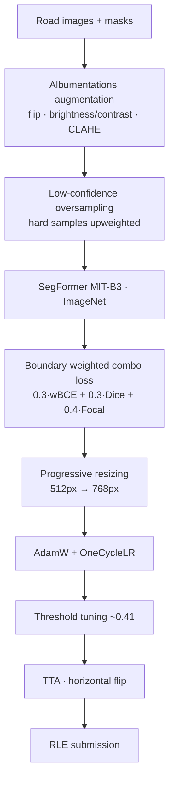

# ARA ITS 2025 — Pothole Semantic Segmentation

> Pixel-level **pothole segmentation** on road imagery for the ARA (ITS) 2025 data-science competition.
> Ranked **53rd / 260**, leaderboard Dice **0.75** (top team 0.82).

**Competition:** ARA — Institut Teknologi Sepuluh Nopember (ITS) 2025
**Result:** **53 / 260** · Dice ≈ **0.75**
**Type:** Binary semantic segmentation (computer vision)

---

## Problem

Given road-surface photos, predict a **binary mask** of pothole regions (RLE-encoded submission). Potholes
are small relative to the frame, have ragged edges, and appear under very different **road surfaces and
lighting** — the standout challenge here.

## Approach



- **Model:** SegFormer (MIT-B3 encoder, ImageNet-pretrained).
- **Custom boundary-weighted loss:** `0.3·weighted-BCE + 0.3·Dice + 0.4·Focal` to emphasize ragged pothole
  edges and handle the tiny-foreground imbalance.
- **Low-confidence oversampling** *(the biggest lever)* — hard/uncertain samples upweighted during training.
- **Progressive resizing** 512 → 768 px, **AdamW + OneCycleLR**, mask-threshold tuning (~0.41), and
  **test-time augmentation** (horizontal flip).
- **What I'd improve:** a **multi-model ensemble** of diverse segmentation architectures to close the gap
  to the top score.

## Tech stack

`Python` · `PyTorch` · `SegFormer / transformers` · `Albumentations` · `OpenCV` · `NumPy`

## How to run

> ⚠️ The competition image/mask dataset is **not included** (competition rules). Point the notebook's data
> path at the ARA dataset. A CUDA GPU is recommended.

```bash
pip install torch torchvision transformers albumentations opencv-python numpy
jupyter notebook pothole_segmentation.ipynb
```

<!-- TODO: add screenshots — sample predicted masks, leaderboard (53/260) -->

## Collaborators

- **Nicho Darren** — [@nichodarren](https://github.com/nichodarren) · [LinkedIn](https://linkedin.com/in/nichodarren/)
- **Ivan William** — [@IvanWiliam13](https://github.com/IvanWiliam13) · [LinkedIn](https://linkedin.com/in/ivanwilliaml/)

Fully collaborative work.
