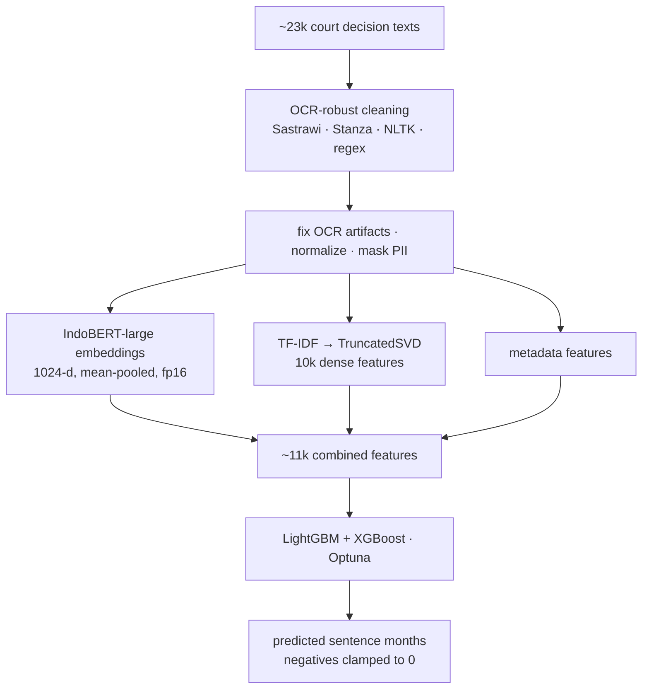

# Dataquest 2025 — Legal Sentence-Length Prediction (Indonesian NLP)

> Predict the **length of a court sentence (in months)** from Indonesian Supreme Court decision texts —
> a right-censored NLP regression over ~23,000 cases. Ranked **57 / 109** (RMSE ≈ 19; top team ≈ 12).

**Competition:** Dataquest 2025
**Result:** **57 / 109** · RMSE ≈ **19 months**
**Type:** NLP regression on legal documents (Bahasa Indonesia)

---

## The story
The data was Indonesian court decisions — scanned, OCR'd, and noisy — and the target was how many months a
sentence would run. Before any model could help, the text had to be made *trustworthy*: repairing OCR
garble, normalizing legalese, masking residual PII. The modeling (fusing IndoBERT with TF-IDF into one
feature space) was the easy half; turning messy legal reality into something learnable was the real work.

## Problem

From the full text of a court decision (OCR'd, noisy, in Bahasa Indonesia), predict the **sentence length
in months**. The target is **right-censored** (very long sentences are capped), and the raw text is messy —
so the hardest part was turning unreliable OCR output into clean, model-ready features.

## Approach



- **OCR-robust text cleaning** *(the hardest / most novel part)* — repair OCR artifacts, normalize
  Indonesian, remove stopwords (Sastrawi/Stanza/NLTK), and mask residual PII.
- **Dual embeddings:** frozen **IndoBERT-large** (1024-d, mean-pooled, fp16) + **TF-IDF → TruncatedSVD**
  (10k) + metadata ≈ **11k features**.
- **Models:** LightGBM + XGBoost, Optuna-tuned; predictions clamped at 0.
- **What I'd improve:** richer / better features (and, given more compute, fine-tuning IndoBERT end-to-end).

## Tech stack

`Python` · `Transformers (IndoBERT)` · `Sastrawi` · `Stanza` · `NLTK` · `scikit-learn (TF-IDF, TruncatedSVD)` · `LightGBM` · `XGBoost` · `Optuna`

## How to run

> ⚠️ The competition legal-text dataset is **not included** (competition rules + sensitive legal data).
> IndoBERT embedding of ~23k documents is compute-heavy (GPU recommended).

```bash
pip install transformers torch sastrawi stanza nltk scikit-learn lightgbm xgboost optuna
jupyter notebook legal_sentence_regression.ipynb
```

<!-- TODO: add screenshots — feature pipeline, leaderboard (57/109) -->

## Collaborators

- **Nicho Darren** — [@nichodarren](https://github.com/nichodarren) · [LinkedIn](https://linkedin.com/in/nichodarren/)
- **Ivan William** — [@IvanWiliam13](https://github.com/IvanWiliam13) · [LinkedIn](https://linkedin.com/in/ivanwilliaml/)

Fully collaborative work.
