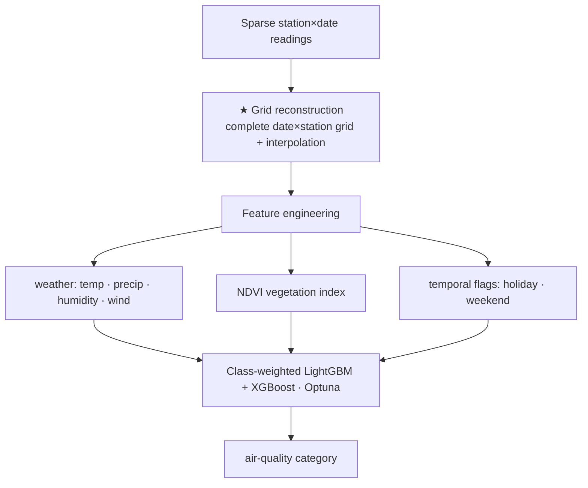

# Datavidia 2025 — Air-Quality Index Classification

> Classify **air-quality index categories** from sparse spatio-temporal sensor data. Ranked **93 / 205**.
> The centerpiece was reconstructing a complete date×station grid before modeling.

**Competition:** Datavidia 2025
**Result:** **93 / 205**
**Type:** Multi-class classification (spatio-temporal tabular)

---

## The story
The catch wasn't the classifier — it was the holes in the data. Air-quality readings arrived with missing
date×station combinations, so a naive model would learn from a Swiss-cheese signal. The move that mattered
was **reconstructing a complete spatio-temporal grid** and interpolating the gaps first, so the model saw a
continuous picture instead of fragments.

## Problem

Predict the air-quality category from pollutant readings (PM10, PM2.5, SO₂, CO, O₃, NO₂) across stations
and dates — but the raw data has **missing date×station combinations** and an **imbalanced** class
distribution. Reconstructing a coherent grid was the hard part.

## Approach



- **Grid reconstruction** *(the novel / hardest part)* — rebuild the full date×station grid and
  interpolate missing cells so the models see a continuous spatio-temporal signal.
- **Feature engineering:** weather (temperature, precipitation, humidity, wind), **NDVI** vegetation index,
  and temporal flags (holiday/weekend).
- **Models:** class-weighted **LightGBM + XGBoost**, Optuna-tuned, with early stopping.
- **What I'd improve:** stronger ensembling of more diverse models.

## Tech stack

`Python` · `LightGBM` · `XGBoost` · `Optuna` · `pandas` · `NumPy` · `scikit-learn`

## How to run

> ⚠️ The competition dataset is **not included** (competition rules).

```bash
pip install lightgbm xgboost optuna pandas numpy scikit-learn
jupyter notebook air_quality_classification.ipynb
```

<!-- TODO: add screenshots — grid-reconstruction illustration, leaderboard (93/205) -->

## Collaborators

- **Nicho Darren** — [@nichodarren](https://github.com/nichodarren) · [LinkedIn](https://linkedin.com/in/nichodarren/)
- **Ivan William** — [@IvanWiliam13](https://github.com/IvanWiliam13) · [LinkedIn](https://linkedin.com/in/ivanwilliaml/)

Fully collaborative work.
